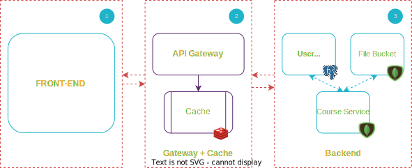
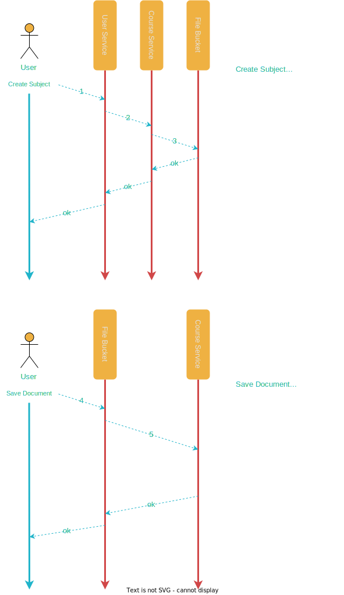

## Pandora Box (back-end) 

## 1. Project Description & Goals (Non Technical)

The app will be a ***medium + udemy with Mind Maps***. Mind maps are a way to store information on different **subjects** to improve the learning experience through a visually structured hierarchical tree. Subjects are presented from top level views to more advanced topics that are related to each other and grouped between.

The system will be back-end focused, but a small front-end interface may be tackled to ease the interaction with the server-side flows.

- ***subject*** refers to an entire tree composed of topics related to the subject.
- ***topics*** refer to a subject's modules and can be referenced or refere to other topics that all relate to one subject. They will be stored as markdown files.

 

**The app will:**
- Store user subjects and topics;
- Organize the topics in a hierarchical manner;
- Log on/Log in users;
- Save user's saved/liked subjects;
- Save subject number of saves and likes.

**Nice to have *(depending on the time & complexity)*:**
- Front-end interface
- Real-time topic editing

 
 

## 2. System Architecture

1. Front-end or the interface will be written with - **React**
2. Api-Gateway written in - **Elixir**
3. Back-end written in - **Kotlin**
    - User Service:
        - POST/PUT users
        - POST/PUT/DELETE saves/likes/subjects
        - Authorize users
    - File bucket:
        - POST/PUT markdown files
    - Course Service:
        - POST/PUT subjects/topics
        - Track hierarchy
        - Store topic's attached document's location
        - Keep track of the number of saves, clicks and likes
 
 

## 3. Backend communication example:

 
 

## 4. Other Technicalities

### - Elixir Gateway

The functional programming language Elixir incorporates qualities that a well designed Distributed System should have: Scalable, Fault-Tolerant, Reliable, Concurrent are the most important ones. And a gateway is a very important piece of the system - if any of the backend system falls, the other should work just fine and we could still use the app in some way, the story with the gateway is very different. Elixir is built to last and endure high loads. It's strategy for let it fail and supervision builds trust with the developer that the service will do fine. The gateway will use:
- Load Balancing - distribute requests evenly to the services, based on load.
- Circuit breaker - it will trip and return a failure response and log it internally
- Outbound REST API calls
- Remove a service if a maximum of failed calls is reached

### - SQL and NoSQL (Back-end)

**Postgres (SQL)** will be used to store users table which shouldn't be subject to future change. Once well defined it shouldn't be a problem to be left as is, and future modification will be improbable and we can rely on SQL's performance to retrieve and store data.
**MongoDB (NoSQL)** is a flexible document based NoSQL database, if there are any changes in the future or the system will scale, we can leverage its qualities to make those kind of transitions less problematic or even seamlessly compared to the SQL databases.

### - Kotlin (Back-end)
Kotlin has a powerful Reactive programming API which empowers Responsivness, Resiliency, Elasticity and is Message Driven - qualities which the system will only benefit from. Therefore we can implement the following:
- Task distribution between services
- Task timeout
- Status Endpoints
- Unit testing
- RPC (remote procedure call)
- Concurrent Task limit

### - Cache
The cache service will prevent the services from unnecessary overloading. If we store public information that was accessed before we can store it and not make unnecessary calls to the services through the network - it can save us time and enhance system's performance.
- Query Language - it will be implemented in elixir and it will use a DSL to retrieve and store data.
